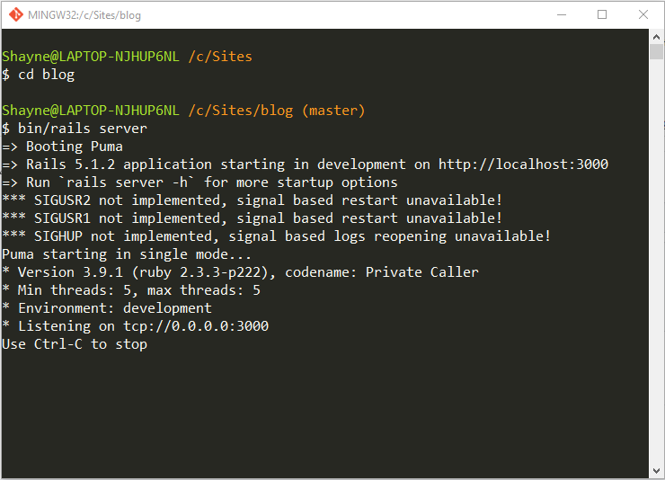
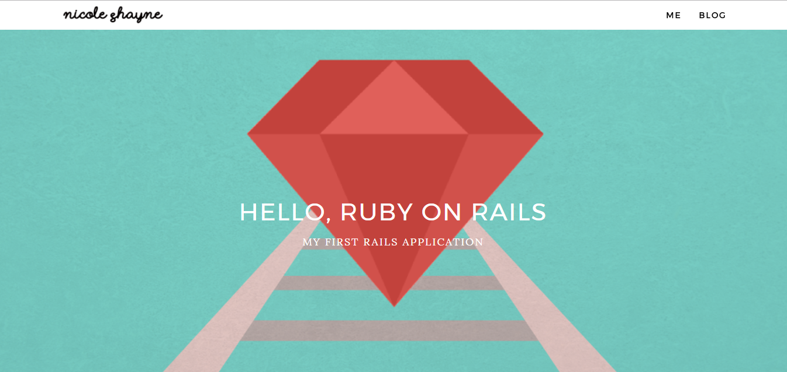

# Coding Bootcamp Term 2 - Ruby on Rails Sample Blog with Design

My First Rails Application from [Ruby on Rails Guides](http://guides.rubyonrails.org/getting_started.html)(now with design).

What is "Ruby on Rails"?
------------------------
Rails is a web application development framework written in the Ruby language. It is designed to make programming web applications easier by making assumptions about what every developer needs to get started. It allows you to write less code while accomplishing more than many other languages and frameworks. Experienced Rails developers also report that it makes web application development more fun.

Installing Rails
----------------
1. *Check Ruby Version*

   First, check if you already have Ruby installed. Open the command prompt and type `ruby -v`. 
   If Ruby responds, and if it shows a version number at or above 2.2.2, then type gem --version. If you don't get an error, skip Install    Ruby step. Otherwise, we'll install a fresh Ruby.⋅⋅
2. *Install Ruby*

   If Ruby is not installed, then download an installation package from [Ruby Installer Site](https://www.ruby-lang.org/en/downloads/).      Follow the download link, and run the resulting installer.⋅⋅
3. *Install Rails*

   With Rubygems loaded, you can install all of Rails and its dependencies using the following command through the command line:
   ```
   gem install rails
   ```
   
4. *Check Rails Version*
   
   Use the following command to check the rails version.
   ```
   rails -v
   ```
   Output should be like:
   ```
   Rails 5.1.2
   ```
The Blog Application
--------------------
All the Blog Application Files can be found at the 'blog' folder.
#### Running the App
1. Clone this repo using your Powershell or (Terminal) by typing this code:
   ```
   git clone https://github.com/ncleshyne/CBT2--Rails-Sample-Application.git
   ```
2. Open Git Bash. Navigate to the path where this downloaded repo is located. Go to the "blog" folder by typing:
   ```
   $ cd blog
   ```
   Note: If you haven't installed git yet, [go here first](https://git-scm.com/book/en/v2/Getting-Started-Installing-Git).
3. Start a web server on your development machine by running the following in the blog directory:
   ```
   $ bin/rails server
   ```
   
4. Finally, open the blog application by opening a browser window and navigating to http://localhost:3000.
   You should be able to see something like this:
   
   
   
   Click "BLOG" and prepare to be amazed by the world of Rails! 


#### Note:
> I included a simple authentication system by Rails. Therefore, clicking "New Article" will prompt you to enter a username and      password. Simply type "Nicole" in the username field and "Secret" in the password. That's all. Please enjoy!
